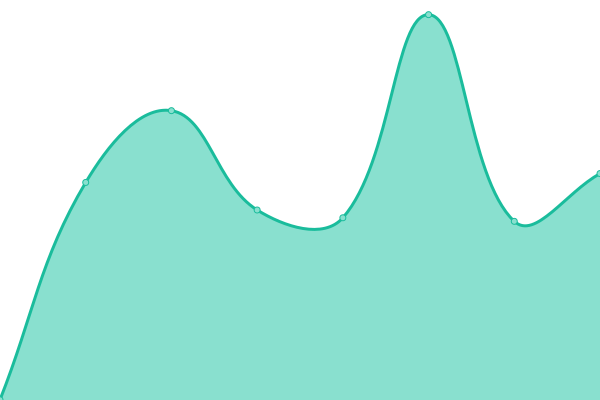
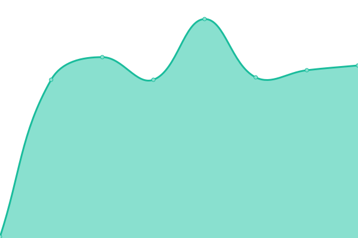
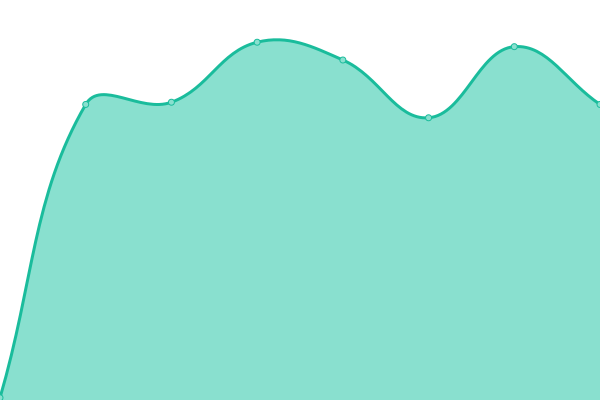

# [📈 Live Status](https://rationai-vis.ics.muni.cz): <!--live status--> **🟩 All systems operational**

This repository contains the open-source uptime monitor and status page for [RationAI Research Group](https://rationai-vis.ics.muni.cz), powered by [Upptime](https://github.com/upptime/upptime).

With [Upptime](https://upptime.js.org), you can get your own unlimited and free uptime monitor and status page, powered entirely by a GitHub repository. We use [Issues](https://github.com/RationAI/demo-uptime/issues) as incident reports, [Actions](https://github.com/RationAI/demo-uptime/actions) as uptime monitors, and [Pages](https://rationai-vis.ics.muni.cz) for the status page.

<!--start: status pages-->
<!-- This summary is generated by Upptime (https://github.com/upptime/upptime) -->
<!-- Do not edit this manually, your changes will be overwritten -->
<!-- prettier-ignore -->
| URL | Status | History | Response Time | Uptime |
| --- | ------ | ------- | ------------- | ------ |
|  [Showcase Main Page](https://rationai-vis.ics.muni.cz/visualization-demo/showcase.php) | 🟩 Up | [showcase-main-page.yml](https://github.com/RationAI/demo-uptime/commits/HEAD/history/showcase-main-page.yml) | 

 1294ms
     
 | 

<a href="https://RationAI.github.io/demo-uptime/history/showcase-main-page">24.38%</a>
    

|  [Showcase Viewer](https://rationai-vis.ics.muni.cz/visualization-demo/client/redirect.php#%7B%22params%22%3A%7B%22bypassCookies%22%3Afalse%7D%2C%22meta%22%3A%7B%7D%2C%22data%22%3A%5B%22CancerDetection%2Ftissue.tif%22%2C%22CancerDetection%2Fannotation.tif%22%2C%22CancerDetection%2Fprobability.tif%22%2C%22CancerDetection%2Fexplainability.tif%22%5D%2C%22background%22%3A%5B%7B%22dataReference%22%3A0%7D%5D%2C%22visualizations%22%3A%5B%7B%22name%22%3A%22Automated%20cancer%20detection%22%2C%22shaders%22%3A%7B%22probability%22%3A%7B%22name%22%3A%22Probability%20Layer%22%2C%22type%22%3A%22heatmap%22%2C%22visible%22%3A1%2C%22dataReferences%22%3A%5B2%5D%2C%22params%22%3A%7B%22color%22%3A%22%23fff705%22%7D%2C%22index%22%3A0%2C%22cache%22%3A%7B%22heatmap%22%3A%7B%7D%7D%2C%22rendering%22%3Atrue%7D%2C%22explainability%22%3A%7B%22name%22%3A%22Explainability%20Layer%22%2C%22type%22%3A%22bipolar-heatmap%22%2C%22visible%22%3A1%2C%22dataReferences%22%3A%5B3%5D%2C%22params%22%3A%7B%7D%2C%22index%22%3A1%2C%22cache%22%3A%7B%22bipolar-heatmap%22%3A%7B%7D%7D%2C%22rendering%22%3Atrue%7D%2C%22annotation%22%3A%7B%22name%22%3A%22Annotation%20Layer%22%2C%22type%22%3A%22edge%22%2C%22visible%22%3A1%2C%22dataReferences%22%3A%5B1%5D%2C%22params%22%3A%7B%22color%22%3A%22%2300eeff%22%2C%22ctrlThreshold%22%3A0%7D%2C%22index%22%3A2%2C%22cache%22%3A%7B%22edge%22%3A%7B%7D%7D%2C%22rendering%22%3Atrue%7D%7D%2C%22params%22%3A%7B%7D%2C%22order%22%3A%5B%22probability%22%2C%22explainability%22%2C%22annotation%22%5D%7D%5D%2C%22shaderSources%22%3A%5B%5D%2C%22plugins%22%3A%7B%22gui_annotations%22%3A%7B%7D%2C%22recorder%22%3A%7B%7D%7D%2C%22dataPage%22%3A%7B%7D%7D) | 🟩 Up | [showcase-viewer.yml](https://github.com/RationAI/demo-uptime/commits/HEAD/history/showcase-viewer.yml) | 

 154ms
     
 | 

<a href="https://RationAI.github.io/demo-uptime/history/showcase-viewer">24.38%</a>
    

|  [Showcase Image Server DZI](https://rationai-vis.ics.muni.cz/iipsrv-demo/iipsrv.fcgi?Deepzoom=CancerDetection/tissue.tif.dzi) | 🟩 Up | [showcase-image-server-dzi.yml](https://github.com/RationAI/demo-uptime/commits/HEAD/history/showcase-image-server-dzi.yml) | 

 1634ms
     
 | 

<a href="https://RationAI.github.io/demo-uptime/history/showcase-image-server-dzi">24.38%</a>
    

|  [Showcase Image Server DZI Array](https://rationai-vis.ics.muni.cz/iipsrv-demo/iipsrv.fcgi?DeepZoomExt=CancerDetection/annotation.tif,CancerDetection/probability.tif,CancerDetection/explainability.tif.dzi) | 🟩 Up | [showcase-image-server-dzi-array.yml](https://github.com/RationAI/demo-uptime/commits/HEAD/history/showcase-image-server-dzi-array.yml) | 

 364ms
     
 | 

<a href="https://RationAI.github.io/demo-uptime/history/showcase-image-server-dzi-array">24.38%</a>
    

|  [Showcase Image Server DZI Array Data](https://rationai-vis.ics.muni.cz/iipsrv-demo/iipsrv.fcgi?DeepZoomExt=CancerDetection/annotation.tif,CancerDetection/probability.tif,CancerDetection/explainability.tif_files/0/0_0.jpg) | 🟩 Up | [showcase-image-server-dzi-array-data.yml](https://github.com/RationAI/demo-uptime/commits/HEAD/history/showcase-image-server-dzi-array-data.yml) | 

 362ms
     
 | 

<a href="https://RationAI.github.io/demo-uptime/history/showcase-image-server-dzi-array-data">24.38%</a>
    

<!--end: status pages-->

[**Visit our status website →**](https://rationai-vis.ics.muni.cz)

## 📄 License

- Powered by: [Upptime](https://github.com/upptime/upptime)
- Code: [MIT](./LICENSE) © [RationAI Research Group](https://rationai-vis.ics.muni.cz)
- Data in the `./history` directory: [Open Database License](https://opendatacommons.org/licenses/odbl/1-0/)
